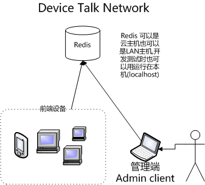
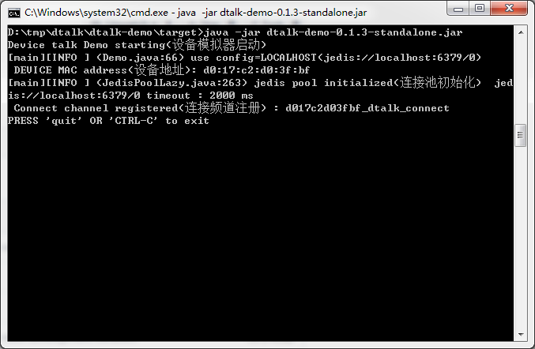
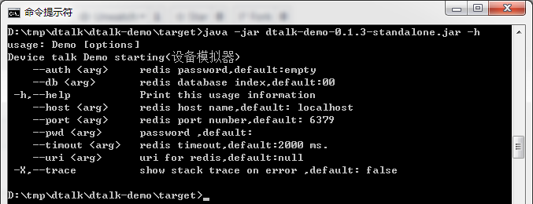
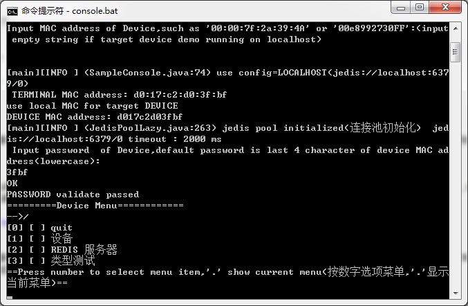
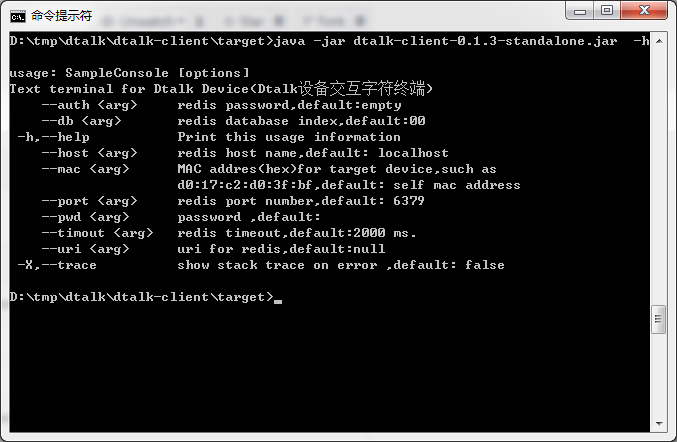

# dtalk(Device Talk)
基于Redis发布订阅(pub/sub)系统实现的前端设备控制框架(java)

## 概述
### 术语

|术语|描述|
|:---------|:-----------------|
|设备端，前端设备|实现特定功能的计算机设备|
|管理端,终端,admin client|以web应用或本地应用方式管理设备端的应用|
|client端|设备端和管理端的统称|
|消息系统|基于redis为client端和服务端提供消息服务的中间件|
|频道,channel|继承 redis 的频道概念，消息系统传递消息时使用的一个有唯一名字和特定数据类型的数据通道，消息发送者将消息发送到指定的频道，该频道的所有消息订阅者就可以及时收到发送者的消息，对于一个频道，消息发送者和订阅者都可以有多个。|

### 介绍

在基于物联网的应用中，各种前端设备需要能被远程管理，当所有的设备都能直接通过ip地址访问时，设计设备管理系统时，只需要把前端设备设备当作一个简单的服务器就可以，比如目前大多数路由器的管理系统就是一个web服务，通过这个web服务，用户可以远程访问路由器的管理页面来对路由进行管理。

但是在一些复杂的应用场景中，我们需要管理的前端设备可能运行于不同的局域网中，不一定能直接通过设备的IP地址访问，所以上述使用直接ip地址访问的方式就不能适用了。

要实现在复杂网络结构中对前端设备进行管理，我们需要一个中转服务，所有的设备端/管理端都连接到这个中转服务上，通过它进行相互的通讯，进而实现对前端设备的管理。

dtalk就是为了实现上述的目标而开发的一个Redis发布订阅(pub/sub)系统实现的前端设备控制框架，在dtalk框架上，Redis服务器用于提供中转服务。前端设备通过订阅特定的频道接收管理发送的请求消息，执行对应的功能。同时执行结果通过发送到指定的响应消息频道，管理端侦听这个响应消息频道收到结果。

下图是dtalk的基本网络结构：

## 软件架构

dtalk在代码结构分为两大块，用运行于前端设备的`dtalk-engine`，和运行于管理端的`dtalk-client`，

dtalk各模块的简介如下：

	├─dtalk-base   dtalk共用模块
	├─dtalk-client dtalk字符终端实现
	├─dtalk-demo   dtalk设备端模拟器
	├─dtalk-engine 命令菜单引擎实现
	└─manual       系统开发文档

### dtalk-base

`dtalk-base` 为共用模块，实现了dtalk的菜单模型，包括选项菜单，设备命令，容器菜单以及，定义了消息通知机制和Redis服务自动发现机制

### dtalk-engine

`dtalk-engine` dtalk菜单引擎，为前端设备实现了基于菜单模型的redis订阅消息驱动的菜单命令执行机制，它侦听指定的频道，接收管理端发送的菜单命令请求，并从菜单模型中找到指定的菜单条目实现选项修改，设备命令执行，和显示子菜单等功能。

### dtalk-client

`dtalk-client` 实现简单的字符终端的命令行运行程序，提供与设备端的菜单引擎的交互界面。连接设备端的菜单引擎，以菜单形式显示菜单内容，向菜单引擎发送菜单命令请求，并显示响应内容

### dtalk-demo

`dtalk-demo` 基于`dtalk-engine`实现了一个简单的dtalk设备端模拟器,模拟一台运行了dtalk引擎的前端设备的命令行执行程序，使用`dtalk-client`可以连接`dtalk-demo`，演示dtalk的工作机制。

## 安装教程

### 系统要求

- JDK 1.7 or above
- Redis 2.8.2 or above
- maven 3.5.0 or above

### 依赖库导入(dependency)

本项目编译的二进制jar包已经发布到maven中央仓库，maven或gradle项目中无须编译就可以直接在自己的项目直接引用.

参见maven中央仓库 

[https://mvnrepository.com/artifact/com.gitee.l0km/dtalk-client](https://mvnrepository.com/artifact/com.gitee.l0km/dtalk-client)

[https://mvnrepository.com/artifact/com.gitee.l0km/dtalk-engine](https://mvnrepository.com/artifact/com.gitee.l0km/dtalk-engine)

### 执行demo

#### 启动redis
首先要启动redis，因为只是执行简单的demo,在本机启动一个redis就可以了，不论是`dtalk-demo`还是`dtalk-client`在执行时如果不给任何参数都是默认连接localhost的redis服务

#### 启动 `dtalk-demo`

以0.1.3版本为例,0.1.3版本dtalk-demo的uber-jar包的下载位置为：

[http://central.maven.org/maven2/com/gitee/l0km/dtalk-demo/0.1.3/dtalk-client-0.1.3-standalone.jar](http://central.maven.org/maven2/com/gitee/l0km/dtalk-client/0.1.3/dtalk-demo-0.1.3-standalone.jar)

下载uber-jar包，在命令执行就可以启动dtalk设备模拟器

		java -jar dtalk-demo-0.1.3-standalone.jar

    	cd dtalk
    	dtalk-demo\demo.bat

	

执行 `engine.bat -h` 可显示帮助信息

#### 启动 `dtalk-client`

以0.1.3版本为例,0.1.3版本dtalk-client的uber-jar包的下载位置为：
[http://central.maven.org/maven2/com/gitee/l0km/dtalk-client/0.1.3/dtalk-client-0.1.3-standalone.jar](http://central.maven.org/maven2/com/gitee/l0km/dtalk-client/0.1.3/dtalk-client-0.1.3-standalone.jar)

		java -jar dtalk-client-0.1.3-standalone.jar

执行 `console.bat -h` 可显示帮助信息

### 项目编译

#### 编译

    	# 克隆源码
    	git clone https://gitee.com/l0km/dtalk.git
    	cd dtalk
    	# 编译
    	mvn install

编译后执行演示程序

1. 启动dtalk-demo

    	cd dtalk
    	dtalk-demo\engine.bat

2. 启动dtalk-client

    	cd dtalk
    	dtalk-client\console.bat

