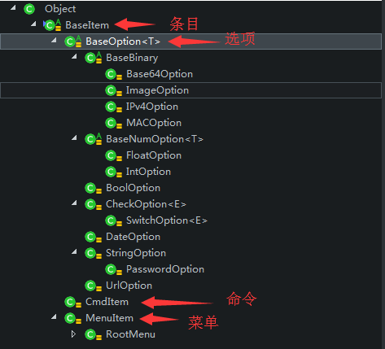
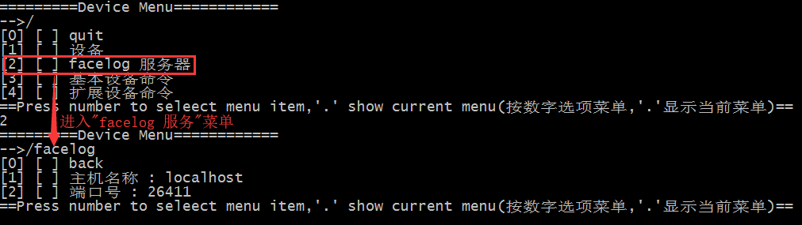
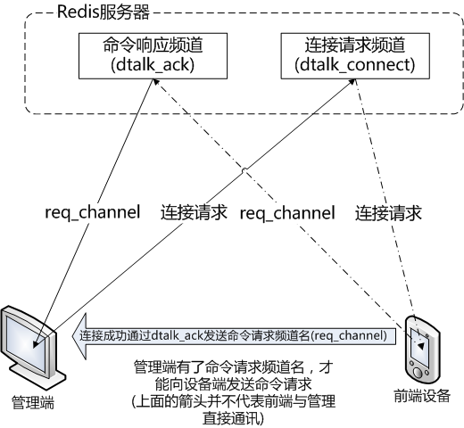
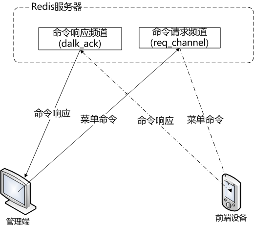

# dtalk(Device Talk)开发手册(更新中)

## 术语

|术语|描述|
|:---------|:-----------------|
|(菜单)条目,item|dtalk设备端菜单数据组织的基本单元|
|(参数)选项,option|存储指定数据类型的数据条目对象,没有子条目|
|(设备)命令,cmd|设备端执行的指定动作的条目，可以包含一个或多个由option对象描述的参数，可以有返回值|
|菜单,menu|包含一个或多个opton或cmd的菜单条目|
|菜单命令|由管理端发送的一个item|

以下为上面术语中在对应的java类，及层次关系图：

## 设备命令

我们希望通过管理软件向前端设备发指令做一些事性，比如开门，比如升级设备端的软件版本，比如汇报当前设备状态，这些事情都可以定义为设备命令。管理端通过dtalk,发送设备命令给前端，前端收到命令并执行然后返回执行结果。这就是基本的设备命令发送执行流程。

dtalk就是用来定义整个设备命令发送和执行的一个开发框架，是管理端和设备端和对话协议框架，所以叫它device talk,

dtalk是基于redis的频道发布订阅功能来实现管理端和设备端的交互通信。管理端和设备端之间建立通信，就是在redis上注册侦听两个消息频道，一个用于管理端向设备端发送命令请求(request channel)，另一个是反向的，叫命令响应频道(ack channel)，用于设备端向管理端发送命令请求的响应消息，由管理端侦听。

管理端让设备端执行一个命令，不论执行的成功或失败，设备端总要吱一声让管理端知道呀--这就是命令响应频道的作用。

管理端如何知道设备有哪些命令或管理选项呢？

这就是dtalk的核心协议：基于树形结构的管理选项定义---直观说就是一个层次结构的菜单

>在管理端输入数字2，设备端将`faceloge 服务器`这个菜单项中的数据发送给管理端，在管理端呈现该菜单的详细内容

如上所示的，设备端通过一个树形结构菜单定义自己能执行的设备命令和管理选项（在发送过程中以json字符串形式传递）。

上图中设备端发送给管理端的`faceloge 服务器`菜单的JSON数据

	{
		"catalog": "MENU",
		"container": true,
		"description": "",
		"disable": false,
		"empty": false,
		"name": "facelog",
		"path": "/facelog",
		"uiName": "facelog \xe6\x9c\x8d\xe5\x8a\xa1\xe5\x99\xa8"
		"childs": 
		[
			{"catalog": "CMD","childs": [],"container": true,"description": "","disable": false,"empty": true,"name": "back","path": "/","taskQueue": null,		"uiName": "back"}, 
			{"catalog": "OPTION","childs": [],"container": false,"defaultValue": null,"description": "",	"disable": false,"empty": true,"name": "host","path": "/facelog/host","readOnly": false,"required": false,"type": "STRING","uiName": "\xe4\xb8\xbb\xe6\x9c\xba\xe5\x90\x8d\xe7\xa7\xb0","value": "localhost"},
			{"catalog": "OPTION","childs": [],"container": false,"defaultValue": 0,"description": "","disable": false,"empty": true,"name": "port","path": "/facelog/port","readOnly": false,"required": false,"type": "INTEGER","uiName": "\xe7\xab\xaf\xe5\x8f\xa3\xe5\x8f\xb7","value": 26411}
		],

	}

管理端收到这个菜单数据后，可以以自己想要的形式呈现给用户。在dtalk实现的简单字符终端中，以简单的列表形式显示设备端管理菜单 。如果在浏览器上用js实现，可以实现更好看的呈现方式。

管理端有了这个菜单，就可以知道该设备有哪些参数可以设置修改，有哪些命令可以执行，每个命令的含义是啥，都需要什么样的参数。

我们把运行在设备端，响应管理的dtalk请求的模块称为dtalk引擎或设备命令引擎。

我们把运行在管理端，向用户呈现管理菜单，向设备端发送dtlk请求，并将收到的响应显示给用户的模块称为dtalk console，或命令console。

设备端有哪些命令和选项，可以根据项目的需要定义，定制设备命令菜单。dtalk engine(命令引擎)负责向管理端发送这个菜单，并执行管理端的设备命令请求。

也就是说，设备端的命令和参数选项完全是自由灵活的，动态定义的。

## 建立连接

如下图,设备端运行后，会订阅只属于自己的连接请求频道，这个频道的频道名是常量,名字格式-- `${设备端MAC地址}_dtalk_connect`,管理端要连接某台设备，必须要知道这台设备的MAC地址，有了MAC地址，就可以向这台设备发送连接请求，设备端收到连接请求后，会验证连接请求是否有效，如果有效则允许管理连接，就会向命令响应频道发送命令请求频道名(request channel)，这个频道名是动态生成的，名字格式--`${设备端MAC地址}_dtalk_[\d]+}`(后缀是个随机数)。

管理端启动后，会订阅只属于自己的命令响应频道名，这个频道的频道名是常量,名字格式---`${管理端MAC地址}_dtalk_ack`。管理端通过响应频道收到连接成功的信号后，也同时会收到命令请求频道名(request channel),有了这个request channel，管理端才能向设备端发送设备命令请求。

管理端到设备端的连接是独占的，设备端以管理端连接时提供的管理端MAC地址来区分管理端，不允许有两个不同的管理端同时连接到同一台设备。如果已经有一个管理端电脑A连接到了设备端，那么另一台管理端电脑B尝试连接该设备时就会报错:`ANOTHER CLIENT LOCKED`

### 验证连接

设备如何验证管理端的连接请求是否合法呢？

dtalk默认的实现方式是密码验证

管理端连接设备端时，向连接请求频道发送如下连接请求数据：

	{
		"mac": "58fb842d294f",/** 管理端自己的MAC地址 */
		"pwd": "33902b064aab3e1c0db64827d8496fce" /** 管理端提供的连接密码(已加密) */
	}

>[gu.dtalk.ConnectReq](..//dtalk-base/src/main/java/gu/dtalk/ConnectReq.java)是上述连接请求字符串反序列化后的实现类

设备端根据管理端提供的连接密码，与本机保存的密码相比较，如果匹配则允许连接，否则报错`INVALID REQUEST PASSWORD`。

### 设备端实现
关于建立连接的设备端实现参见[gu.dtalk.engine.SampleConnector](../dtalk-engine/src/main/java/gu/dtalk/engine/SampleConnector.java)

这只是dtalk提供的默认连接实现，应用程序在使用dtalk的时候，可以根据业务需求实现[gu.dtalk.engine.RequestValidator](..//dtalk-engine/src/main/java/gu/dtalk/engine/RequestValidator.java) 接口，实现不同的连接验证方式。

比如[facelog](https://gitee.com/l0km/facelog)项目在使用dtalk时就重写了此方法，参见[net.gdface.facelog.client.dtalk.TokenRequestValidator](https://gitee.com/l0km/facelog/blob/master/facelog-client-base/src/main/java/net/gdface/facelog/client/dtalk/TokenRequestValidator.java)

### 管理端实现
关于建立连接的管理端实现参见 [gu.dtalk.client.SampleConsole#authorize()](../dtalk-client/src/main/java/gu/dtalk/client/SampleConsole.java)方法

## 命令交互

管理端与设备端命令交互的过程，就是管理发送菜单请求，设备端响应菜单请求的过程。

下面的json字符是一个完整的menu菜单示例

		{"catalog":"MENU","name":"","path":"/","uiName":"","container":true,"description":"","disable":false,"empty":false,
		  	"childs":[
			  	{"catalog":"CMD","name":"quit","path":"/quit","childs":[],"container":true,"description":"","disable":false,"empty":true,"taskQueue":null,"uiName":"quit"},
			  	{"catalog":"MENU","name":"menu1","path":"/menu1","uiName":"菜单1","container":true,"description":"","disable":false,"empty":false,
				 	"childs":[
				  	{"catalog":"CMD","childs":[],"container":true,"description":"","disable":false,"empty":true,"name":"back","path":"/","taskQueue":null,"uiName":"back"},
				  	{"catalog":"MENU","name":"menu1_1","path":"/menu1/menu1_1","uiName":"菜单1.1",,"container":true,"description":"","disable":false,"empty":false
					 	"childs":[
					  		{"catalog":"CMD","name":"back","path":"/","taskQueue":null,"uiName":"back","childs":[],"container":true,"description":"","disable":false,"empty":true},
					  		{"catalog":"OPTION""name":"option1","uiName":"选项1","path":"/menu1/menu1_1/option1","childs":[],"container":false,"defaultValue":null,"description":"","disable":false,"empty":true,,"readOnly":false,"required":false,"type":"STRING","value":null},
					  		{"catalog":"OPTION","name":"option2","uiName":"选项2","path":"/menu1/menu1_1/option2","childs":[],"container":false,"defaultValue":0,"description":"","disable":false,"empty":true,"readOnly":false,"required":false,"type":"INTEGER","value":null}
						]}]},
			  	{"catalog":"MENU","container":true,"description":"","disable":false,"empty":false,"name":"menu2","path":"/menu2","uiName":"菜单2",
				 	"childs":[
					  	{"catalog":"CMD","name":"back","path":"/","uiName":"back","childs":[],"container":true,"description":"","disable":false,"empty":true,"taskQueue":null},
					  	{"catalog":"MENU","name":"menu2_1","path":"/menu2/menu2_1","uiName":"菜单2.1","container":true,"description":"","disable":false,"empty":false,
						 	"childs":[
							  	{"catalog":"CMD","name":"back","uiName":"back","path":"/","childs":[],"container":true,"description":"","disable":false,"empty":true,"taskQueue":null},
								{"catalog":"CMD","name":"cmd1","uiName":"命令1","path":"/menu2/menu2_1/cmd1","container":true,"description":"","disable":false,"empty":true,"taskQueue":null,
									"childs":[
										{"catalog": "OPTION","name": "param1","uiName": "命令参数1","path": "/menu2/menu2_1/cmd1/param1","childs": [],"container": false,"defaultValue": null,"description": "","disable": false,"empty": true,"readOnly": false,"required": false,"type": "STRING","value": null}
									]
								}
							]}]}
			]
		}

如下图，管理端通过命令请求频道发送菜单命令，设备端收到菜单命令后，根据菜单命令的类型执行相应的动作

### MENU

如果菜单命令是一个菜单(menu)，则设备端将对应的菜单内容(通过命令响应频道)返回给管理端，如下就是一条管理端发送给设备端的菜单(menu)命令.

	{"catalog":"MENU","path":"/"}

该命令只有两个字段:

1. `path`代表要执行的命令(在设备端菜单树形结构中)的全路径。"/"即为根菜单。
2. `catalog`指定了该命令的类型为菜单(menu)，这个字段可以省略，设备端根据`path`就可以找到对应的menu,并将menu数据作为响应数据(ack)通过命令响应频道发送给管理端

### OPTION

如果菜单命令是一个选项(option)，则设备端会修改指定option的值，如下就是一条管理端发送给设备端的option菜单命令.

	{"catalog":"OPTION","path":"/menu1/menu1_1/option1","value":"HELLO"}
	#NOTE: 'catalog'字段可以省略

设备端收到这条命令后，就会将搜索`path`指定的选项,将该选项的值设置为`HELLO`

### CMD

如果菜单命令是一个(设备)命令(cmd)，则设备端会执行指定的设备命令，如下就是一条管理端发送给设备端的cmd菜单命令.

	{"catalog":"CMD","path":"/menu2/menu2_1/cmd1" "childs":[{"name": "param1","value":"HELLO"}]}
	#NOTE: 'catalog'字段可以省略

设备端收到这条命令后，会执行指定的动作，设备命令的内容由应用程序实现，比如设备重启，比如远程升级

上面这个例子中，`cmd1`这个设备命令定义了一个参数`param1`作为子节点

关于命令交互的设备端实现参见 [gu.dtalk.engine.ItemEngine](../dtalk-engine/src/main/java/gu/dtalk/engine/ItemEngine.java)

关于命令交互的管理端实现参见 [gu.dtalk.client.BaseConsole#cmdInteractive()](../dtalk-client/src/main/java/gu/dtalk/client/BaseConsole.java)方法

## (菜单)条目定义

### (菜单)条目类型说明

|TYPE|说明|Java类/基类|
|:---------|:-----------------|:-|
|OPTION|参数选项，对应《术语》中的(参数)选项|[gu.dtalk.BaseOption](../dtalk-base/src/main/java/gu/dtalk/BaseOption.java)|
|CMD|(设备)命令,cmd|[gu.dtalk.CmdItem](../dtalk-base/src/main/java/gu/dtalk/CmdItem.java)|
|MENU|菜单,menu|[gu.dtalk.MenuItem](../dtalk-base/src/main/java/gu/dtalk/MenuItem.java)|

### 选项(OPTION)类型说明

|TYPE|说明|Java类|
|:---------|:-----------------|:-|
|STRING|任意字符串|[gu.dtalk.StringOption](../dtalk-base/src/main/java/gu/dtalk/StringOption.java)|
|INTEGER|整数|[gu.dtalk.IntOption](../dtalk-base/src/main/java/gu/dtalk/IntOption.java)|
|FLOAT|浮点数|[gu.dtalk.FloatOption](../dtalk-base/src/main/java/gu/dtalk/FloatOption.java)|
|BOOL|布尔型 true/false 0/1|[gu.dtalk.BoolOption](../dtalk-base/src/main/java/gu/dtalk/BoolOption.java)|
|DATE|日期 支持的格式:yyyy-MM-dd HH:mm:ss|[gu.dtalk.DateOption](../dtalk-base/src/main/java/gu/dtalk/DateOption.java)|
|URL|url字符串|[gu.dtalk.UrlOption](../dtalk-base/src/main/java/gu/dtalk/UrlOption.java)|
|PASSWORD|密码字符串|[gu.dtalk.PasswordOption](../dtalk-base/src/main/java/gu/dtalk/PasswordOption.java)|
|EMAIL|e-mail地址|[gu.dtalk.StringOption](../dtalk-base/src/main/java/gu/dtalk/StringOption.java)|
|MPHONE|手机号码(11位)|[gu.dtalk.StringOption](../dtalk-base/src/main/java/gu/dtalk/StringOption.java)|
|IDNUM|身份证号(15位、18位数字)|[gu.dtalk.StringOption](../dtalk-base/src/main/java/gu/dtalk/StringOption.java)|
|BASE64|base64 格式二进制数据|[gu.dtalk.Base64Option](../dtalk-base/src/main/java/gu/dtalk/Base64Option.java)|
|MAC|网卡MAC地址二进制数据|[gu.dtalk.MACOption](../dtalk-base/src/main/java/gu/dtalk/MACOption.java)|
|IP|IP地址二进制数据|[gu.dtalk.IPv4Option](../dtalk-base/src/main/java/gu/dtalk/IPv4Option.java)|
|IMAGE|base64 格式JPEG/BMP/PNG格式图像|[gu.dtalk.ImageOption](../dtalk-base/src/main/java/gu/dtalk/ImageOption.java)|
|MULTICHECK|多选列表|[gu.dtalk.CheckOption](../dtalk-base/src/main/java/gu/dtalk/CheckOption.java)|
|SWITCH|单选列表|[gu.dtalk.SwitchOption](../dtalk-base/src/main/java/gu/dtalk/SwitchOption.java)|

### (菜单)条目定义字段

|字段名|说明|MENU|OPTION|CMD
|:---------|:-----------------|:-|:-|:-|
|catalog|item分类类型，可选的值MENU,OPTION,CMD,参见《(菜单)条目类型说明》|Y|Y|Y|
|name|条目名称([a-zA-Z0-9_],不允许有空格)|Y|Y|Y|
|uiName|条目的用户界面显示名称,如果不指定则使用{@link #name}|Y|Y|Y|
|path|当前对象在整个菜单树形结构中的全路径|Y|Y|Y|
|container|是否为容器(可包含item),当catalog为MENU,CMD时为true|Y|Y|Y|
|description|对当前条目的说明文字，默认值：空|Y|Y|Y|
|disable|当前条目是否禁用,默认值:false|Y|Y|Y|
|hide|当前条目是否在用户界面中隐藏(不显示),默认值:false|Y|Y|Y|
|childs|所有子条目,当catalog为OPTION时，恒为空|Y|Y|Y|
|empty| 是否有子条目,即childs中元素不为0,当catalog为OPTION时,恒为0|Y|Y|Y|
|type|选项的类型,可选的值参见《OPTION类型说明》||Y||
|readOnly|是否为只读的选项,当catalog为CMD时,恒为false||Y||
|required|是否为必须的选项，默认值:false||Y||
|value|选项值||Y||
|defaultValue|选项默认值||Y||
|taskQueue|任务队列名,该字段不为空时,对象支持队列任务|||Y|

NOTE:上表中后三列为Y，代表此字段适合该类型的菜单条目

### 创建菜单

dtalk提供了[gu.dtalk.ItemBuilder](../dtalk-base/src/main/java/gu/dtalk/ItemBuilder.java)用于创建menu和cmd,提供了[gu.dtalk.OptionBuilder](..dtalk-base/src/main/java/gu/dtalk/OptionBuilder.java)

如下是创建前面的示例的菜单的代码：

	public void test6Menu(){
		MenuItem menu1 = ItemBuilder.builder(MenuItem.class).name("menu1").uiName("菜单1").addChilds(
				ItemBuilder.builder(MenuItem.class).name("menu1_1").uiName("菜单1.1").addChilds(
						OptionType.STRING.builder().name("option1").uiName("选项1").instance(),
						OptionType.INTEGER.builder().name("option2").uiName("选项2").instance()
						).instance()
				).instance();
		MenuItem menu2 = ItemBuilder.builder(MenuItem.class).name("menu2").uiName("菜单2").addChilds(
				ItemBuilder.builder(MenuItem.class).name("menu2_1").uiName("菜单2.1").addChilds(
							ItemBuilder.builder(CmdItem.class).name("cmd1").uiName("命令1").instance().addParameters(
									OptionType.STRING.builder().name("param1").uiName("命令参数1").instance()
									)
						).instance()
				).instance();
		RootMenu root = new RootMenu();
		root.addChilds(menu1,menu2);
		
		logger.info(BaseJsonEncoder.getEncoder().toJsonString(root));
	}

完整代码参见 [gu.dtalk.ItemTest](../dtalk-base/src/test/java/gu/dtalk/ItemTest.java)

### 设备命令实现

dtalk的设备命令由设备命令执行接口([gu.dtalk.CmdItem.ICmdAdapter](../dtalk-base/src/main/java/gu/dtalk/CmdItem.java))定义.

	/**
	 * 设备命令执行接口
	 * @author guyadong
	 *
	 */
	public static interface ICmdAdapter {
		/**
		 * 执行设备命令
		 * @param input 以值对(key-value)形式提供的输入参数
		 * @return 命令返回值，没有返回值则返回{@code null}
		 * @throws CmdExecutionException 命令执行失败
		 */
		Object apply(Map<String, Object> input) throws CmdExecutionException;
	}

应用程序实现了设备命令执行接口后，通过`gu.dtalk.CmdItem.setCmdAdapter`方法绑定到指定的设备命令。当设备端收到这个设备命令时就会执行对应的`ICmdAdapter`实例.

该接口实例在`CmdItem`实例中被`gu.dtalk.CmdItem.runCmd`方法调用 

	/**
	 * 执行命令
	 * @return
	 * @throws CmdExecutionException
	 */
	public final Object runCmd() throws CmdExecutionException{
		synchronized (items) {
			if(cmdAdapter !=null){
				try {
					// 将 parameter 转为 Map<String, Object>
					Map<String, Object> objParams = Maps.transformValues(items, TO_VALUE);
					return cmdAdapter.apply(checkRequired(objParams));					
				} finally {
					reset();
				}
			}
			return null;
		}
	}

## 任务队列

(待续)