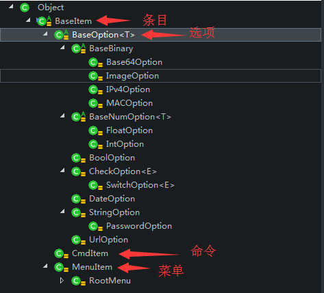

# dtalk(Device Talk)开发手册

## 术语

|术语|描述|
|:---------|:-----------------|
|条目,item|dtalk设备端菜单数据组织的基本单元|
|(参数)选项,option|存储指定数据类型的数据条目对象,没有子条目|
|命令,cmd|设备端执行的指定动作的条目，可以包含一个或多个由option对象描述的参数，可以有返回值|
|菜单|包含一个或多个opton或cmd的菜单条目|
|菜单命令|由管理端发送的一个item|

以下为上面术语中在对应的java类，及层次关系图：

## 建立连接

关于建立连接的设备端实现参见[gu.dtalk.engine.SampleConnector](../dtalk-engine/src/main/java/gu/dtalk/engine/SampleConnector.java)

关于建立连接的管理端实现参见 [gu.dtalk.client.SampleConsole#authorize()](../dtalk-client/src/main/java/gu/dtalk/client/SampleConsole.java)方法

## 命令交互

关于命令交互的设备端实现参见 [gu.dtalk.engine.ItemEngine](../dtalk-engine/src/main/java/gu/dtalk/engine/ItemEngine.java)

关于命令交互的管理端实现参见 [gu.dtalk.client.BaseConsole#cmdInteractive()](../dtalk-client/src/main/java/gu/dtalk/client/BaseConsole.java)方法